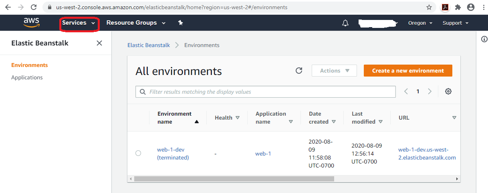

# Getting Started
## Install Golang and create your first GO HTTP Server
### Install Golang
1. Install golang in your machine. Follow instructions here - https://golang.org/dl/
1. After the install is done, you should be able to open your command prompt (do it after the install is done or go path env will not be set yet) and type in `go` and get the following


1. Now you are all set and create your sample program

### Create a GO HTTP Server
1. Create a directory under `HOMEPATH/go/src` and copy the contents of `web-1` including the folder structure
1. Go to `HOMEPATH/go/src/web-1` and type in `go run application.go`. You will see that the program starts and command line blocks. That is because we started a HTTP server in port 8081
1. To test, open your favorite web browser and type in `http://localhost:5000` and `http://localhost:5000/increment` (try this command a few times and see how the counter increments)
1. Come back to the command line - which is blocking and hit `Ctrl+c` to stop the HTTP Server. We do not want you to run a non-HTTPS server on your machine
1. Run
```
go build -o bin/application application.go
```
This step is needed for the application to successfully run in AWS Elastic Beanstalk. AWS expects certain conventions to be followed as explained here -- https://docs.aws.amazon.com/elasticbeanstalk/latest/dg/go-environment.html. The command creates a `bin` directory under `HOMEPATH/go/src/web-1` and has the compiled executable called `application`.


## Get an account in AWS
### Create an Account
Follow the steps mentioned here : https://aws.amazon.com/premiumsupport/knowledge-center/create-and-activate-aws-account/ to create a AWS account first. The short video in the page gives a good walk through of the process. Note: Choose the `Basic Support Plan` - which is free
### Create an access key and Secret
Follow the steps mentioned here: https://docs.aws.amazon.com/general/latest/gr/aws-sec-cred-types.html#access-keys-and-secret-access-keys to get a aws secret and key. Follow the steps mentioned under `To create an access key when signed in as the root user` in the document as a starter.

In case you are wondering, for accessing the AWS Console UI, we need the userid and password. However for accessing using the command-line aka CLI, we will be using the key (referred to as ` Access Key ID` or `aws-access-id`  ) and secret (referred to as `Secret Access Key` or `aws-secret-key` ). These will be needed for access through the command line. For accessing

## Download AWS Elastic Beanstalk client
### What is AWS Elastic Beanstalk
**As mentioned in https://aws.amazon.com/elasticbeanstalk**
AWS Elastic Beanstalk is an easy-to-use service for deploying and scaling web applications and services developed with Java, .NET, PHP, Node.js, Python, Ruby, Go, and Docker on familiar servers such as Apache, Nginx, Passenger, and IIS.

You can simply upload your code and Elastic Beanstalk automatically handles the deployment, from capacity provisioning, load balancing, auto-scaling to application health monitoring. At the same time, you retain full control over the AWS resources powering your application and can access the underlying resources at any time.

### Download Elastic Beanstalk client
1. You can read more about Elastic Beanstalk here: https://console.aws.amazon.com/elasticbeanstalk/home?region=us-east-1#/welcome
1. Follow the instructions here works to install the `eb cli`: https://docs.aws.amazon.com/elasticbeanstalk/latest/dg/eb-cli3-install-windows.html

```
This method did not work. In the final step, while running the installer after the code download, Windows10 does not allow to run this code because of security concerns. We need to sort this out first before recommending. However, I am keeping the steps documented as this is the recommended method.
1. Download git client from https://git-scm.com/downloads
1. And click on the downloaded exe file to complete the Install
1. Accept default choices in all screens except those shown in the following screenshots (omitted them till we get this working)
1. Go to this page: https://github.com/aws/aws-elastic-beanstalk-cli-setup and just download the code - as per the screenshot - and the unzip and run the installer (and Windows10 blocks this)
```

## Deploy your application in the Cloud

Below, we show you the steps to run using the `eb cli`. You can do exactly the same thing using the browser at  https://console.aws.amazon.com/elasticbeanstalk/home as well.

### Run eb init
At first you go to the directory where your code is: `HOMEPATH/go/src/web-1` and run `eb init`

```

C:\Users\johndoe\go\src\web-1>eb init

Select a default region
1) us-east-1 : US East (N. Virginia)
2) us-west-1 : US West (N. California)
3) us-west-2 : US West (Oregon)
4) eu-west-1 : EU (Ireland)
5) eu-central-1 : EU (Frankfurt)
6) ap-south-1 : Asia Pacific (Mumbai)
7) ap-southeast-1 : Asia Pacific (Singapore)
8) ap-southeast-2 : Asia Pacific (Sydney)
9) ap-northeast-1 : Asia Pacific (Tokyo)
10) ap-northeast-2 : Asia Pacific (Seoul)
11) sa-east-1 : South America (Sao Paulo)
12) cn-north-1 : China (Beijing)
13) cn-northwest-1 : China (Ningxia)
14) us-east-2 : US East (Ohio)
15) ca-central-1 : Canada (Central)
16) eu-west-2 : EU (London)
17) eu-west-3 : EU (Paris)
18) eu-north-1 : EU (Stockholm)
19) eu-south-1 : EU (Milano)
20) ap-east-1 : Asia Pacific (Hong Kong)
21) me-south-1 : Middle East (Bahrain)
22) af-south-1 : Africa (Cape Town)
(default is 3):

You have not yet set up your credentials or your credentials are incorrect
You must provide your credentials.
(aws-access-id): XYZ...
(aws-secret-key): abc/def/ghi....

Enter Application Name
(default is "web-1"):
Application web-1 has been created.
Select a platform.
1) .NET Core on Linux
2) .NET on Windows Server
3) Docker
4) GlassFish
5) Go
6) Java
7) Node.js
8) PHP
9) Packer
10) Python
11) Ruby
12) Tomcat
(make a selection): 5

Select a platform branch.
1) Go 1 running on 64bit Amazon Linux 2
2) Go 1 running on 64bit Amazon Linux
3) Preconfigured Docker - Go 1.4 running on 64bit Debian (Deprecated)
4) Preconfigured Docker - Go 1.3 running on 64bit Debian (Deprecated)
(default is 1):

Cannot setup CodeCommit because there is no Source Control setup, continuing with initialization
Do you want to set up SSH for your instances?
(Y/n): n

C:\Users\johndoe\go\src\web-1>
```
A few points:
1. Since we have not installed the `aws cli` yet, it asks for the `aws-access-id` and `aws-secret-key` to be provided. If `aws cli` was configured, these would have been picked up automatically.
1. It detects the application name from the directory in which this command is being run.
1. CodeCommit cannot be setup because we are not running this command from a directory which has git set up yet.
1. We could ask for `SSH access to the instance` in which case there would be a few additional steps. We chose not to do so to keep matters simple.

### Run eb create

```

C:\Users\johndoe\go\src\web-1>eb create
Enter Environment Name
(default is web-1-dev):
Enter DNS CNAME prefix
(default is web-1-dev):

Select a load balancer type
1) classic
2) application
3) network
(default is 2):


Would you like to enable Spot Fleet requests for this environment? (y/N): N

2.0+ Platforms require a service role. We will attempt to create one for you. You can specify your own role using the --service-role option.
Type "view" to see the policy, or just press ENTER to continue:
Creating application version archive "app-200809_095047".
Uploading web-1/app-200809_095047.zip to S3. This may take a while.
Upload Complete.
Environment details for: web-1-dev
  Application name: web-1
  Region: us-west-2
  Deployed Version: app-200809_095047
  Environment ID: e-kembw8fcea
  Platform: arn:aws:elasticbeanstalk:us-west-2::platform/Go 1 running on 64bit Amazon Linux 2/3.1.0
  Tier: WebServer-Standard-1.0
  CNAME: web-1-dev.us-west-2.elasticbeanstalk.com
  Updated: 2020-08-09 16:50:50.827000+00:00
Printing Status:
2020-08-09 16:50:49    INFO    createEnvironment is starting.
 -- Events -- (safe to Ctrl+C)
 ```
At this point you can hit Ctrl+C and exit, and the deployment will continue to run. Then you would have to log into the UI at  https://console.aws.amazon.com/elasticbeanstalk/home to see when it completes. If you do decide for the command to continue to run, it will end in 5~10 minutes as shown below:
```
2020-08-09 17:01:04    INFO    Instance deployment completed successfully.
2020-08-09 17:01:38    INFO    Application available at web-1-dev.us-west-2.elasticbeanstalk.com.
2020-08-09 17:01:39    INFO    Successfully launched environment: web-1-dev

```
### Run eb open
To view your application, you can simply run the following command and it will launch your golang application in your browser!
```
C:\Users\johndoe\go\src\web-1>eb open

```
### Explore eb
Type in `eb --help` to see available commands
A few which you can try are - consult `eb --help` to see what they mean:
```
eb logs
eb health
eb status
eb events
eb config
eb console
```
## Clean up
You do not want any unexpected bills from Amazon. Therefore we need to terminate this toy application as shown below:
```
C:\Users\johndoe\go\src\web-1>eb terminate
The environment "web-1-dev" and all associated instances will be terminated.
To confirm, type the environment name: web-1-dev
2020-08-09 19:53:51    INFO    terminateEnvironment is starting.
2020-08-09 19:54:09    INFO    Deleted CloudWatch alarm named: awseb-e-hne2kiwrgp-stack-AWSEBCloudwatchAlarmLow-1BY7P231JUDW2
2020-08-09 19:54:09    INFO    Deleted CloudWatch alarm named: awseb-e-hne2kiwrgp-stack-AWSEBCloudwatchAlarmHigh-1H0X92CVCIWP9
2020-08-09 19:54:09    INFO    Deleted Load Balancer listener named: arn:aws:elasticloadbalancing:us-west-2:502886772653:listener/app/awseb-AWSEB-744R6F2QQ7QL/936f06f3f43c7ee5/d70e45d65ea3320a
2020-08-09 19:54:09    INFO    Deleted load balancer named: arn:aws:elasticloadbalancing:us-west-2:502886772653:loadbalancer/app/awseb-AWSEB-744R6F2QQ7QL/936f06f3f43c7ee5
2020-08-09 19:54:09    INFO    Deleted Auto Scaling group policy named: arn:aws:autoscaling:us-west-2:502886772653:scalingPolicy:24bded9f-b02b-491a-b62a-aedeb2c9fa69:autoScalingGroupName/awseb-e-hne2kiwrgp-stack-AWSEBAutoScalingGroup-11D9S4FJYDDKU:policyName/awseb-e-hne2kiwrgp-stack-AWSEBAutoScalingScaleUpPolicy-1K8BSUURPEK0G
2020-08-09 19:54:09    INFO    Deleted Auto Scaling group policy named: arn:aws:autoscaling:us-west-2:502886772653:scalingPolicy:b71db2b0-ef45-47de-9801-4709f652d1e9:autoScalingGroupName/awseb-e-hne2kiwrgp-stack-AWSEBAutoScalingGroup-11D9S4FJYDDKU:policyName/awseb-e-hne2kiwrgp-stack-AWSEBAutoScalingScaleDownPolicy-CZOY0X3WTAPE
2020-08-09 19:54:09    INFO    Waiting for EC2 instances to terminate. This may take a few minutes.
2020-08-09 19:56:10    INFO    Deleted Auto Scaling group named: awseb-e-hne2kiwrgp-stack-AWSEBAutoScalingGroup-11D9S4FJYDDKU
2020-08-09 19:56:10    INFO    Deleted target group named: arn:aws:elasticloadbalancing:us-west-2:502886772653:targetgroup/awseb-AWSEB-TH7PM6Z4Y4MF/e3aae44c77980bbd
2020-08-09 19:56:11    INFO    Deleted Auto Scaling launch configuration named: awseb-e-hne2kiwrgp-stack-AWSEBAutoScalingLaunchConfiguration-FJCKPYCDW86Y
2020-08-09 19:56:11    INFO    Deleted security group named: awseb-e-hne2kiwrgp-stack-AWSEBSecurityGroup-JN2G3FK04ANM
2020-08-09 19:56:11    INFO    Deleted security group named: sg-0b67bfa1401a913dd
2020-08-09 19:56:13    INFO    Deleting SNS topic for environment web-1-dev.
2020-08-09 19:56:14    INFO    terminateEnvironment completed successfully.


C:\Users\johndoe\go\src\web-1>    
```
Now if you launch back into the UI at  https://console.aws.amazon.com/elasticbeanstalk/home , you will see the environment and application appear show as `terminated` - but will continue to appear for around an hour. Everything is cleaned up now except for `S3 buckets`. This will have to be cleaned up using the UI. S3 buckets are used as data store to store the program which we created. And it is specially guarded using `policies` so that it is not accidentally deleted.

### Deleting S3 bucket
#### Delete the Bucket policy
1. Launch into the UI at  https://console.aws.amazon.com/elasticbeanstalk/home and click on `Services` as shown


1. Go to S3 buckets

1. Click on the S3 bucket name

1. Delete the Bucket Policy using steps as shown


#### Delete the bucket
And this will bring you back to the initial page where you see the S3 bucket. You can select the bucket and delete it now - and have successfully cleaned up!

# Looking Back
We created a Golang application, made sure it works on our local machine and then ran it in the AWS Cloud using AWS Elastic Beanstalk!
